

<h1>Sentinela: detecção e bloqueio de rastreadores no Firefox</h1>

Avaliação Intermediária de Cibersegurança · Insper · Prof. João Eduardo Luisi

<table class="info">
<tr><td>Aluno</td><td>Alex Chequer</td></tr>
<tr><td>Repositório</td><td>https://github.com/AlexChequer/sentinela</td></tr>
<tr><td>Entrega</td><td>29/09/2026</td></tr>
<tr><td>Conteúdo</td><td>Entregáveis 2 (DuckDuckGo Privacy Test Pages), 3 (três sites reais) e 4 (score de privacidade)</td></tr>
</table>

Todos os números deste relatório vêm das evidências em <code>evidencias/</code> no repositório: prints, JSONs exportados pela extensão, HARs do DevTools e prints do Blacklight e do uBlock Origin.

<!--SUMARIO-->

## 1. Ambiente de teste

| Item | Valor |
|---|---|
| Navegador | Firefox 156.0.1 (macOS), perfil dedicado "sentinela", sem histórico, logins ou outras extensões |
| Proteção do navegador | Enhanced Tracking Protection em **Padrão** (inclui Total Cookie Protection) |
| Extensão | Sentinela, carregada como extensão temporária em `about:debugging` |
| uBlock Origin | perfil separado "ublock", listas padrão |
| Blacklight | themarkup.org/blacklight, parâmetros padrão do site (`device=mobile`, `location=us-ca`) |
| Coleta nos sites | 28/09/2026, sem login, dados do site apagados antes, **sem interagir com o banner de cookies**, cerca de 20 s parado |

**Por que isso importa.** As páginas do DuckDuckGo medem o **navegador inteiro**,
não só a extensão. O ETP e o Total Cookie Protection (TCP) do Firefox bloqueiam
ou particionam várias coisas antes de a Sentinela agir, e boa parte das
divergências deste relatório vem daí. O perfil dedicado com ETP Padrão deixa
essas interferências conhecidas e reproduzíveis. A coleta sem clicar no banner
de cookies reproduz o que o Blacklight faz (ele também não interage).

## 2. A extensão: objetivo, instalação e arquitetura

A Sentinela é uma extensão para Firefox que mostra, por aba, o que uma página faz
com a privacidade de quem a visita: a quais terceiros ela se conecta e quais são
rastreadores, que cookies e que armazenamento local ela grava, se tenta
identificar o navegador (canvas fingerprint), se repassa identificadores entre
sites (bounce tracking e cookie sync) e se há sinais de sequestro do navegador
(hook). Com isso ela calcula um score de privacidade de 0 a 100, e também
bloqueia domínios de uma lista pessoal.

**Instalação.** Abrir `about:debugging#/runtime/this-firefox` → *Carregar
extensão temporária…* → selecionar `extension/manifest.json`. Depois, abrir um
site e clicar no ícone da Sentinela. Se o Firefox não conceder a permissão de
acesso aos sites automaticamente, o popup mostra um botão para pedi-la.

**Arquitetura.**

| Componente | Arquivos | Papel |
|---|---|---|
| Background | `background/*.js` | Um relatório por aba, reiniciado a cada navegação. Observa requisições (`webRequest`), lê `Set-Cookie`, monta a cadeia de navegação, detecta sync, WebSocket e polling, cancela requisições da lista de bloqueio e calcula o score. Estado espelhado em `storage.session`. |
| Scripts da página | `content/main-world.js`, `fp-world.js`, `hook-world.js` | Rodam no mundo principal da página, em `document_start`, antes dos scripts do site. Instrumentam cookies, storage, canvas, inserção de scripts, listeners de teclado e comparam globais e funções nativas depois do `load`. |
| Ponte | `content/bridge.js` | Mundo isolado: recebe os eventos da página e os envia ao background. |
| Interface | `popup/`, `report/` | Popup com abas e página de relatório por aba (usada nos prints). |
| Dados | `data/trackers.js`, `lib/tldts.umd.min.js` | Lista Disconnect (gerada por `scripts/build-tracker-db.mjs`) e Public Suffix List. |
| Testes e apoio | `tests/pages/`, `scripts/` | Página local de hook, reconciliação HAR × ferramentas e gerador deste PDF. |

**Como detecta.** A extensão é Manifest V3 para Firefox 128+. Ela observa a rede
(`webRequest`), a navegação (`webNavigation`) e, com scripts no mundo principal
da página (`world: "MAIN"`, em `document_start`), as APIs que os scripts usam.
O código, organizado por funcionalidade, está em `extension/`, e o histórico de
commits mostra a evolução ao longo da semana.

| Detecção | Como |
|---|---|
| Terceiros | eTLD+1 da requisição ≠ eTLD+1 da aba (Public Suffix List via tldts, com a seção privada) |
| Rastreadores | lista Disconnect (a mesma base do ETP), `urlClassification` do Firefox e domínios de teste do DDG; classificação **por host** |
| Cookies | `Set-Cookie` (HTTP) e `document.cookie`/`cookieStore` (JS); 1ª/3ª parte × sessão/persistente; `Domain=` de sufixo público marcado como rejeitado |
| Storage HTML5 | localStorage, sessionStorage, IndexedDB e Cache API, por frame |
| Canvas fingerprint | critério de Englehardt & Narayanan (2016), o mesmo do OpenWPM |
| Bounce tracking | cadeia de saltos por aba; site intermediário ≠ origem e destino, saída por redirecionamento ou em menos de 5 s, com estado |
| Cookie sync | hash FNV-1a de valor guardado em cookie/storage de um site aparecendo em parâmetro de requisição para outro site |
| Parâmetros de rastreamento | `utm_*`, `gclid`, `fbclid`, `msclkid`… e identificadores enviados a terceiros |
| Hijacking / hook | WebSocket e polling para terceiros, globais novas em `window`, nativas substituídas, scripts de terceiros injetados, listeners de teclado, assinaturas de BeEF |
| Bloqueio | lista personalizada (domínio e subdomínios) e opção "bloquear rastreadores conhecidos", com `webRequest` bloqueante |
| Score | 0–100, 14 critérios (seção 5) |

A interface tem um popup com abas (Terceiros, Score, Cookies, Armazenamento,
Fingerprint, Navegação, Ameaças, Bloqueio) e uma **página de relatório** por
aba, usada nos prints dos sites reais.

**Discrição e privacidade do próprio relatório.** Os hooks são `Proxy` sobre as
funções nativas, e nenhuma global nova é criada. No Firefox, o `toString()` de
um `Proxy` perde o nome da função, então `Function.prototype.toString` também é
interceptado (seção 3.9). A extensão nunca guarda valores de cookies ou de
storage: guarda só o nome, o tamanho e o hash FNV-1a, que basta para reconhecer
um identificador repassado.

## 3. Entregável 2: DuckDuckGo Privacy Test Pages {: .newpage }

### 3.1 Tabela resumo

| # | Teste | Esperado (reportado pela página) | Resultado da Sentinela | Divergência | Print |
|---|---|---|---|---|---|
| 1 | Tracker Reporting (`1major-via-script`) | 1 rastreador grande carregado via script | `doubleclick.net`: terceiro e rastreador (Disconnect: Google/Advertising; Firefox: `tracking_ad`); score 96 | nenhuma | 3.2 |
| 2 | Storage blocking | página grava em 23 mecanismos, 1 falha (WebSQL) | 27 cookies (7 de 1ª e 20 de 3ª parte; 9 HTTP e 18 JS) e localStorage, sessionStorage, IndexedDB e Cache API nos 4 contextos | mecanismos fora do escopo (3.3) | 3.3 |
| 3 | Fingerprinting / canvas | testes de *resistance* falham (o Firefox com ETP Padrão não aleatoriza o canvas) | 21 leituras de canvas, 0 fingerprints; browserleaks: 2 fingerprints | a página mede aleatorização, não fingerprinting (3.4) | 3.4 |
| 4 | Tracker Blocking (`request-blocking`) | sem bloqueio tudo carrega (exceto websocket); com bloqueio, recursos de `bad.third-party.site` falham | duas rodadas com bloqueio: modo "bloquear rastreadores" e **lista personalizada** com `bad.third-party.site` (o que a página pede); nas duas, 22 requisições canceladas e todos os itens falham, inclusive `serviceworker-fetch` | websocket falha mesmo sem bloqueio (3.5) | 3.5 |
| 5 | Storage partitioning | todos os mecanismos "pass" (particionados) | vê 2 cookies e o storage da página principal; os iframes de teste rodam em outra aba | o particionamento é do navegador (3.6) | 3.6 |
| 6 | Bounce tracking | ID de `bad.third-party.site` repassado ao destino pela URL | bounce detectado (0,2–0,4 s) e ID repassado via `bounceUIDlocalStorage`/`bounceUIDcookie`; `good.third-party.site`: sem bounce | definição por site × por origem (3.7) | 3.7 |
| 7 | Query parameters | o navegador deveria remover `utm_*`, `fbclid`, `fb_source` | detecta os 4 parâmetros e ignora `q`, `id`, `u`; não remove | detecção ≠ remoção (3.8) | 3.8 |
| 8 | js-leaks (security) | lista de diferenças de `window` em relação ao perfil de referência | resultado idêntico com e sem a extensão | nenhuma após correção (3.9) | 3.9 |
| 9 | Página própria de hook (extra) | hook simulado no estilo BeEF | BeEF (3 assinaturas), WebSocket, polling (~2 s), `fetch`/XHR substituídos, 2 scripts injetados, captura de teclado; score 20 (F) | nenhuma | 3.10 |

### 3.2 Tracker Reporting

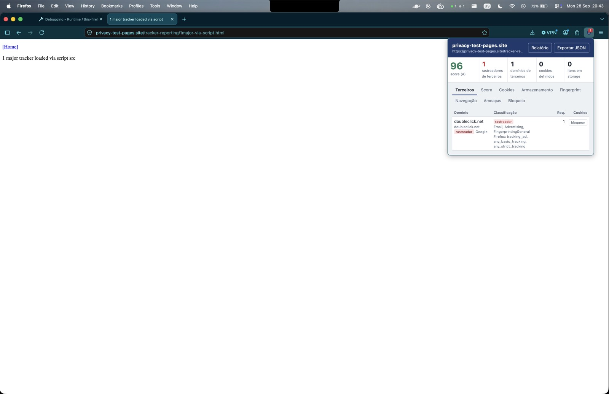

A página carrega um script de `securepubads.g.doubleclick.net`. A Sentinela o
marca como terceiro (eTLD+1 diferente de `privacy-test-pages.site`) e como
rastreador por duas fontes independentes: a lista Disconnect (Google,
Advertising) e a `urlClassification` que o próprio Firefox anexa à requisição
(`tracking_ad`). Com ETP Padrão numa janela normal, o Firefox não bloqueia esse
script, então a requisição acontece e aparece. Score 96 (−4, um rastreador de
anúncio).

### 3.3 Storage blocking

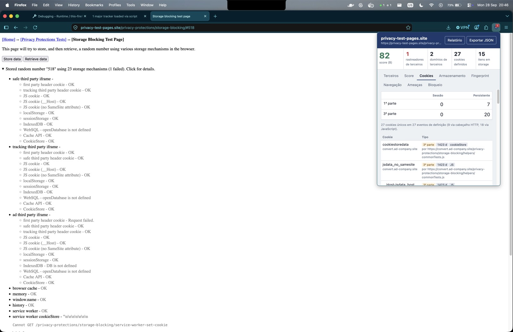

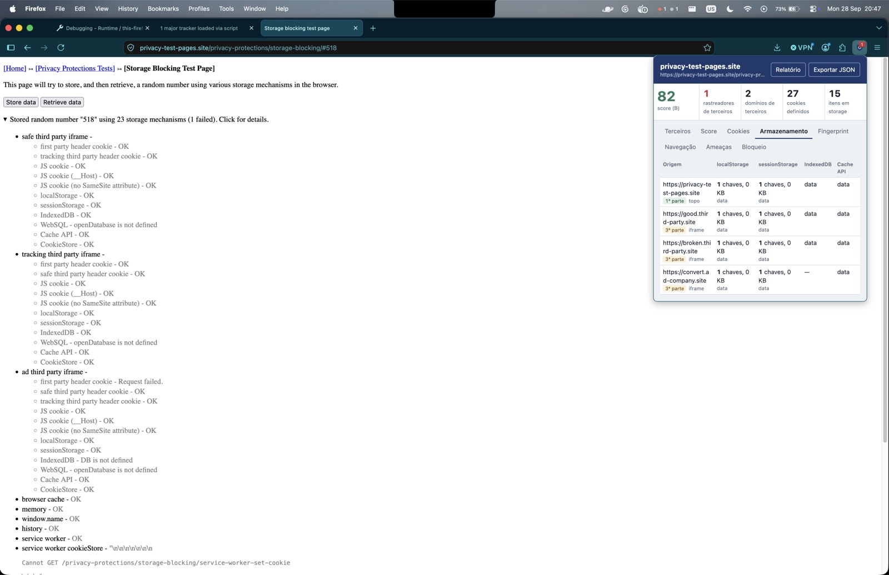

A página grava o número aleatório em cada mecanismo, na página e em três
iframes: "safe" (`good.third-party.site`), "tracking"
(`broken.third-party.site`) e anúncio (`convert.ad-company.site`). A Sentinela
viu **27 cookies únicos** (7 de 1ª parte e 20 de 3ª, todos persistentes; 9 via
`Set-Cookie`, 18 via JS, 4 deles pela Cookie Store API) e o storage nos 4
contextos. O IndexedDB só não aparece no iframe de anúncio, onde a própria
página reporta "DB is not defined".

A classificação é **por host**: `good.` e `broken.third-party.site` são o mesmo
site, mas só o segundo está na blocklist do DDG, e a Sentinela mostra cada um
com a própria marca. Os cookies `tptdata` e `tpsdata` são de 1ª parte, mas foram
gravados por scripts de `broken.` e `good.third-party.site`, e a Sentinela
registra o script que gravou.

Divergências:

- **WebSQL**: a página reporta erro (`openDatabase is not defined`). O Firefox não
  implementa WebSQL.
- **window.name, history, cache HTTP, service worker e cookieStore dentro de
  service worker**: fora do escopo. Não são storage HTML5 no sentido da rubrica,
  ou rodam fora da aba (requisições de service worker têm `tabId = -1`).
- **"Aceito" ≠ "isolado"**: todos os cookies de terceiros aparecem como aceitos
  porque o TCP não bloqueia, **particiona**. O cookie existe, mas só na partição
  do site de topo.

### 3.4 Fingerprinting / canvas

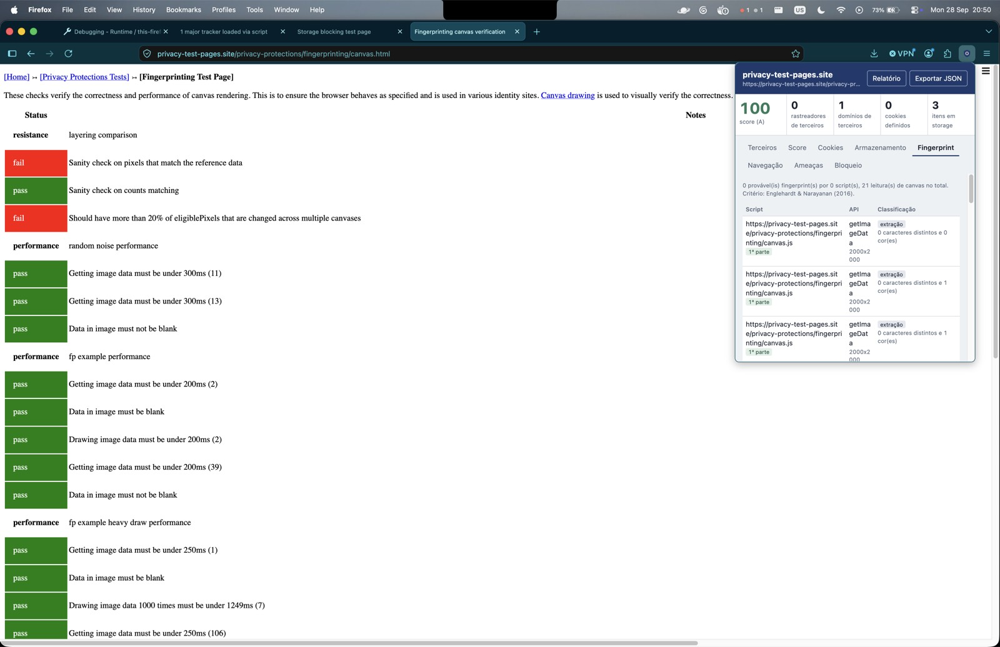

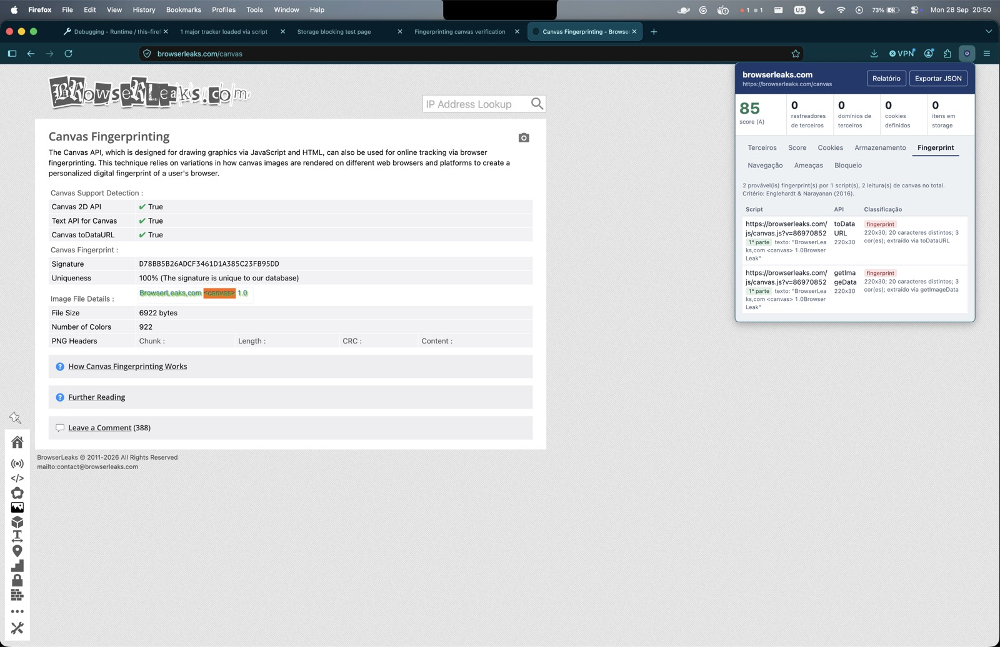

A Sentinela classifica cada leitura de canvas pelo critério de Englehardt &
Narayanan (2016): canvas ≥ 16×16, texto com ≥ 10 caracteres distintos ou ≥ 2
cores, extração por `toDataURL`/`toBlob`/`getImageData`, sem formato com perdas.

- **DDG `canvas.html`**: 21 leituras (`getImageData` e `toDataURL` em canvas de
  1×1 a 3840×2160), **nenhuma** classificada como fingerprint. A página escreve
  pixels aleatórios com `putImageData` e os lê de volta, sem desenhar texto,
  porque mede se o **navegador aleatoriza** a leitura. O resultado dela
  ("fail" nos testes de *resistance*) mostra que o Firefox com ETP Padrão não
  aleatoriza. A Sentinela registra as leituras como "extração" e não as confunde
  com fingerprinting.
- **browserleaks.com/canvas** (controle positivo): 2 leituras classificadas como
  fingerprint (`canvas.js`, 220×30, 20 caracteres distintos, 3 cores, texto
  "BrowserLeaks,com <canvas> 1.0"). O fingerprint roda dentro de um iframe
  `about:blank` criado por script, e a extensão atribui a ele a origem da página.

### 3.5 Tracker Blocking

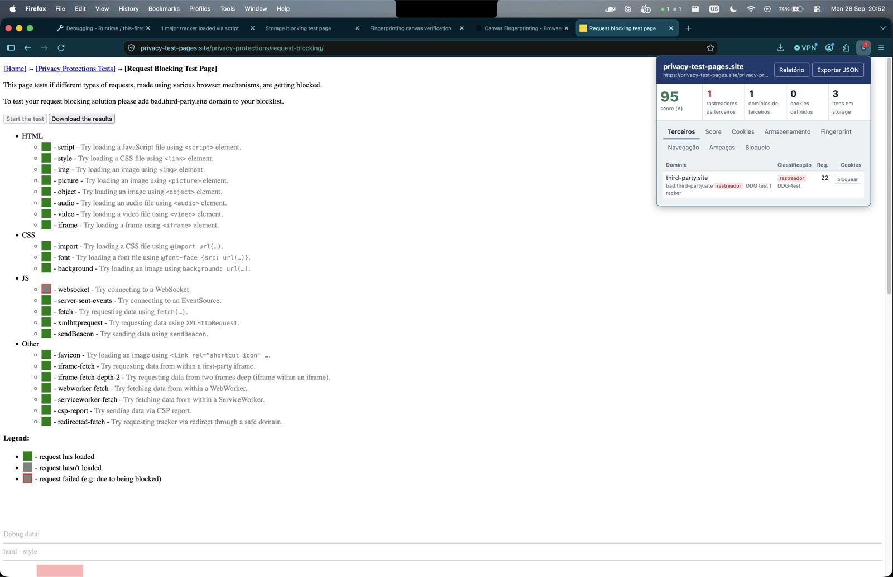

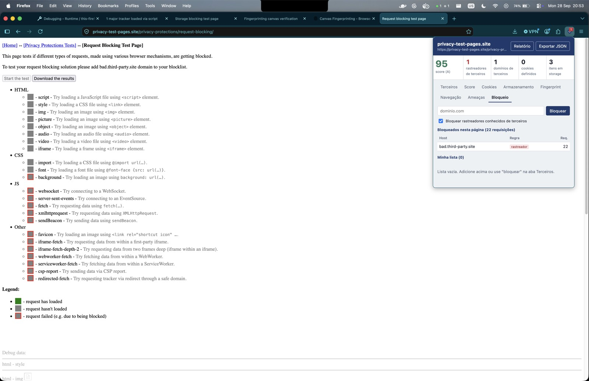

Sem bloqueio, todos os recursos carregam, exceto o **websocket**, que falha mesmo
sem nenhuma extensão ativa: o servidor WebSocket de teste não respondeu. Com a
opção "bloquear rastreadores conhecidos", a Sentinela cancela em
`onBeforeRequest` as **22** requisições a `bad.third-party.site`. Os elementos
HTML aparecem como "hasn't loaded" (cinza), porque a página só percebe que o
`onload` não aconteceu, e os de CSS/JS/Other como "failed" (borda vermelha).

O `serviceworker-fetch` passava na primeira versão: requisições feitas por
service worker chegam com `tabId = -1`, e o bloqueio ignorava o que não tinha
aba. A correção decide a parte (1ª/3ª) pelo `originUrl` (o próprio worker).
A requisição passou a ser bloqueada, mas não entra na contagem de nenhuma aba,
por isso o contador continua em 22.

**Lista de bloqueio personalizada.** A página pede literalmente para adicionar
`bad.third-party.site` à blocklist. Na segunda rodada, com a opção "bloquear
rastreadores" **desmarcada**, o domínio foi adicionado em "Minha lista" pelo
popup. O resultado foi o mesmo: 22 requisições canceladas, todas com a regra
`lista: bad.third-party.site` (no JSON exportado, `rule: "lista"`), e todos os
itens da página marcados como não carregados ou falhos. Um domínio da lista
bloqueia também os subdomínios, e a lista fica em `storage.local`, então vale
para todas as abas até ser removida.

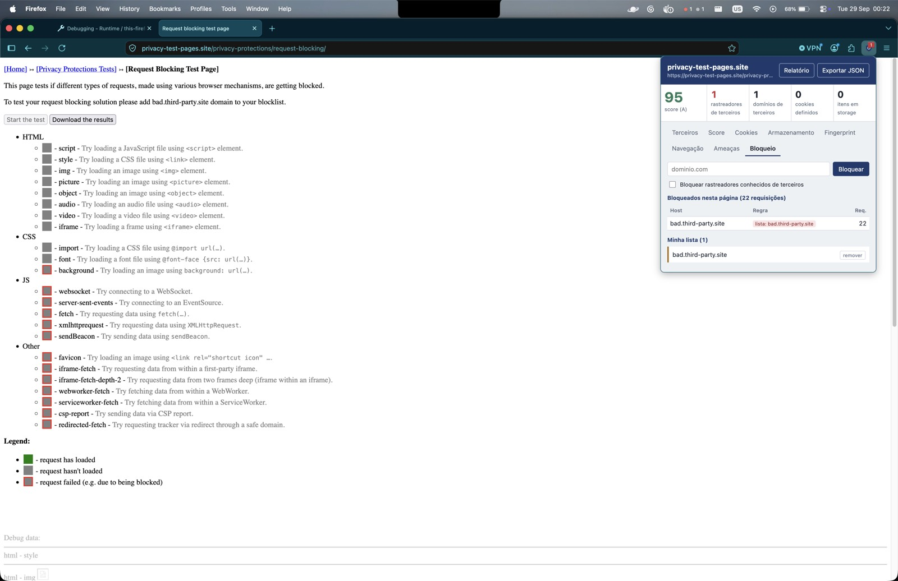

### 3.6 Storage partitioning

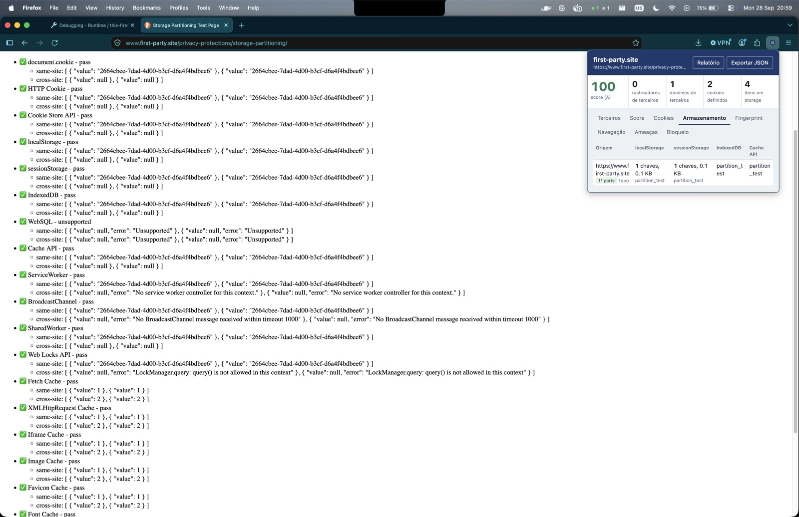

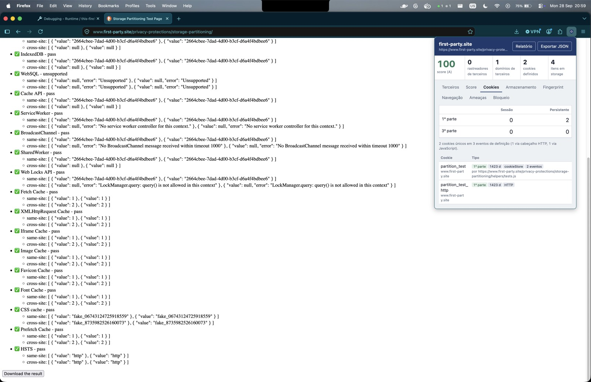

A página precisa ser aberta em `www.first-party.site`: em
`privacy-test-pages.site` ela desabilita o botão e redireciona em 2 s. Todos os
mecanismos deram **pass**: no contexto *same-site* o iframe lê o ID
(`2664cbee-…`), e no *cross-site* lê `null`. É o Total Cookie Protection
particionando cookies, storage, caches, service worker, BroadcastChannel,
SharedWorker, Web Locks e HSTS.

A divergência é de papel: quem cumpre o "esperado" aqui é o **navegador**, não a
extensão. A Sentinela só observa. Ela mostra a página principal com 2 cookies de
1ª parte (`partition_test` via cookieStore e `partition_test_http`) e 1 chave em
cada mecanismo. Os iframes cross-site do teste rodam na aba auxiliar que a
página abre e fecha sozinha, e o relatório da Sentinela é por aba.

### 3.7 Bounce tracking

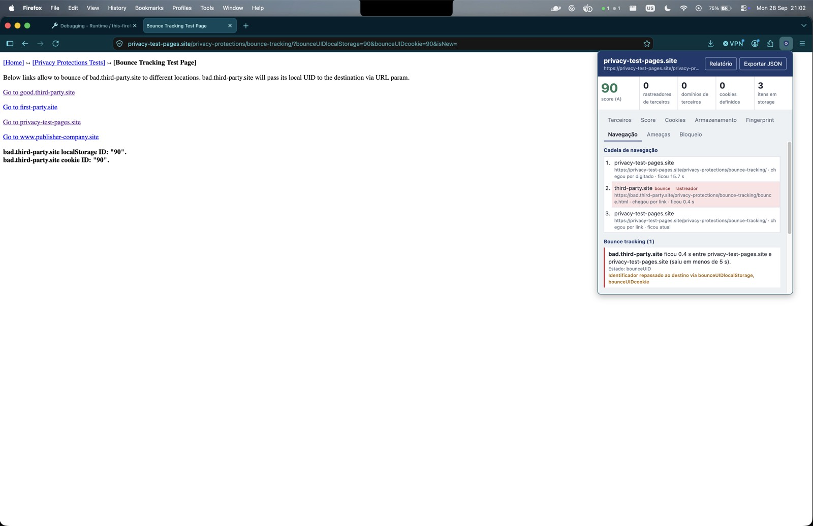

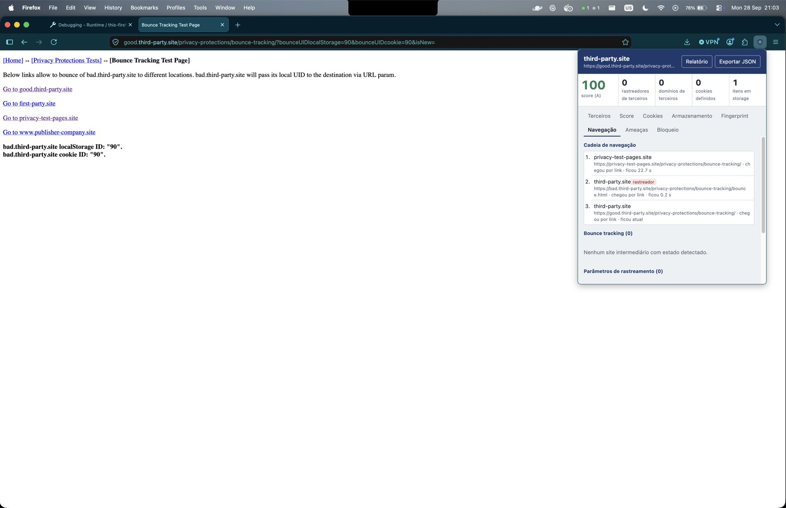

A página leva a `bad.third-party.site/.../bounce.html`, que grava `bounceUID` em
cookie e localStorage e redireciona com `location.href` dentro de `setTimeout`,
repassando o ID na URL.

- A Sentinela aponta o bounce: salto de 0,4 s (e de 0,2 s na segunda visita)
  entre privacy-test-pages.site e ele mesmo, com estado (`bounceUID`). Ela também
  reconhece o **ID repassado via `bounceUIDlocalStorage` e `bounceUIDcookie`**,
  porque o hash do valor lido no bouncer é igual ao hash do parâmetro na URL de
  destino. Nos testes de 26/09, a primeira visita (ID novo) foi reconhecida via
  `isNew`.
- O Firefox **não** marca esse redirecionamento como `client_redirect` em
  `webNavigation`: ele chega como "link". Quem detecta é a regra de permanência
  curta (< 5 s).
- "Go to good.third-party.site": **sem bounce**. `bad.` e `good.third-party.site`
  são o mesmo site (eTLD+1), e a Sentinela usa a definição por site, a mesma da
  mitigação de bounce tracking do Firefox e do Chrome. O DDG considera o caso
  porque o ID muda de **origem**.

### 3.8 Query parameters

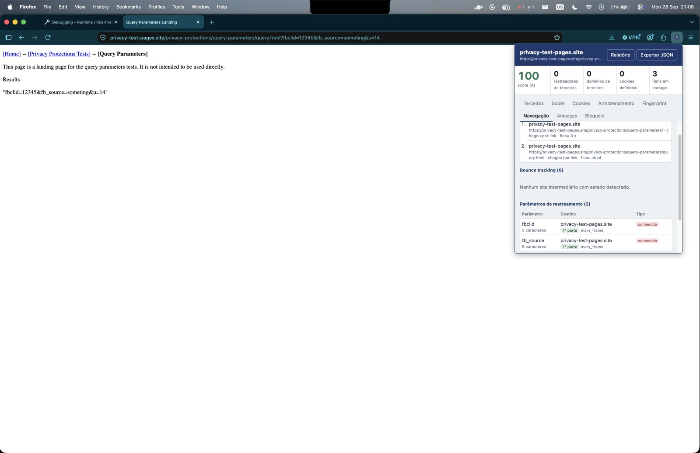

A Sentinela detecta `utm_source`, `utm_medium`, `fbclid` e `fb_source` como
parâmetros de rastreamento conhecidos e ignora `q`, `id` e `u`. O "esperado" da
página é o navegador **remover** esses parâmetros (resultado `"q=other"`, `"u=14"`).
A página mostra `"utm_source=something&q=other"` porque o Firefox com ETP Padrão
não remove, e a Sentinela detecta, mas não reescreve URLs.

### 3.9 js-leaks

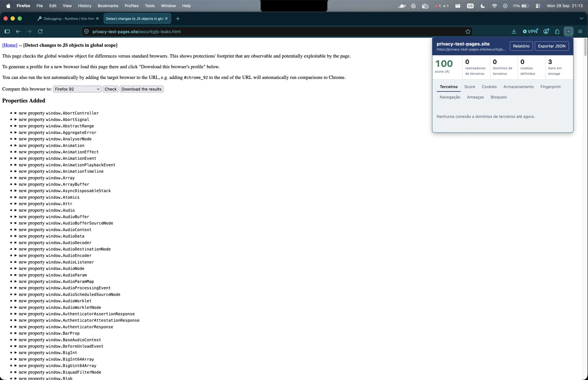

A página compara as propriedades de `window` (descritores e `toString()` das
funções) com um perfil de referência. Como a referência é o Firefox 92, a lista
de "adicionadas" é longa em qualquer Firefox atual. O que interessa é a
**diferença entre rodar com e sem a extensão**.

Na primeira versão, a Sentinela aparecia: **17 funções** como "changed" (ex.:
`localStorage.clear`, `indexedDB.open`), porque no Firefox o `toString()` de um
`Proxy` devolve `function () { [native code] }` sem o nome. Depois da correção
(interceptar `Function.prototype.toString` para os proxies da extensão), a
comparação automatizada no Firefox 156 deu resultado **idêntico com e sem a
extensão**: 889 adicionadas, 17 removidas, 2 alteradas nos dois casos.

### 3.10 Página própria de hook

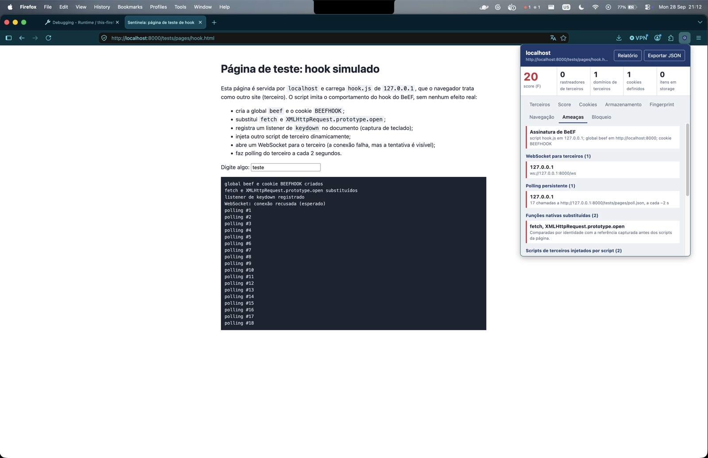

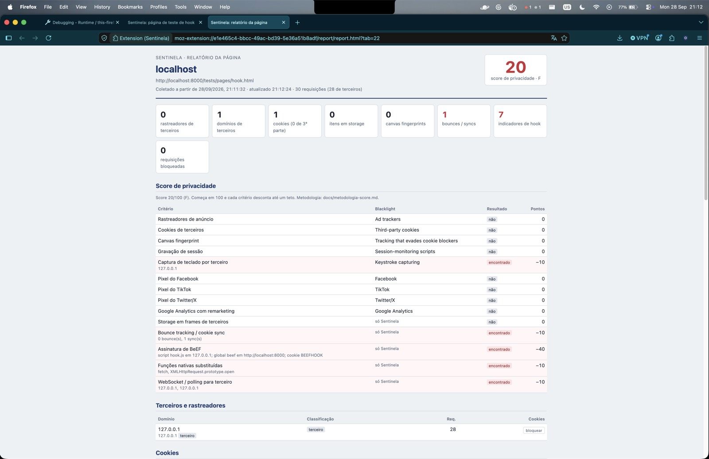

Como o BeEF real exige um servidor e uma página vulnerável, o repositório tem
uma página local (`tests/pages/hook.html`) cujo `hook.js`, carregado de
`127.0.0.1` (outro site para o navegador), imita o comportamento do hook sem
nenhum efeito real. A Sentinela detectou tudo:

- as três assinaturas de BeEF (script `hook.js`, global `beef`, cookie
  `BEEFHOOK`);
- WebSocket para `ws://127.0.0.1:8000/ws`;
- polling de `poll.json` a cada ~2 s (17 chamadas no momento do print e 30
  no JSON exportado depois, porque o polling continua enquanto a página fica aberta);
- `fetch` e `XMLHttpRequest.prototype.open` substituídos;
- dois scripts de terceiro injetados por script;
- listener de `keydown`.

Ela também apontou um **cookie sync**: o valor do cookie `BEEFHOOK` vai como
parâmetro `session=` no polling, exatamente o que o hook do BeEF faz com a
sessão. Score 20 (F).

## 4. Entregável 3: sites reais {: .newpage }

Sites: **uol.com.br** (portal com publicidade), **mercadolivre.com.br**
(e-commerce) e **pt.wikipedia.org** (referência sem publicidade). Os sites foram
escolhidos pelo aluno, seguindo a orientação que circulou na turma de que cada
aluno escolheria os seus, com três perfis diferentes de propósito: um site
financiado por anúncios, um de comércio eletrônico e um sem publicidade, que
serve de controle. Para cada
site: HAR (`<site>.har`), JSON da Sentinela, prints da página de relatório,
Blacklight e uBlock Origin, em `evidencias/sites/<site>/`. A reconciliação
domínio a domínio foi gerada por `scripts/reconcile.mjs`
(`<site>-reconciliacao.md`).

### 4.1 Visão geral

| | UOL | Mercado Livre | Wikipedia |
|---|---|---|---|
| Requisições (Sentinela / HAR) | 426 / 401 | 219 / 437 | 35 / 39 |
| Sites de terceiros (Sentinela / HAR) | 35 / 35 | 10 / 10 | 1 / 1 |
| Rastreadores de terceiros (Sentinela) | 24 | 3 | 0 |
| Rastreadores de anúncio (Sentinela, critério 1 do score) | 18 | 1 | 0 |
| Ad trackers (Blacklight) | 21 | 11 | 0 |
| uBlock: requisições bloqueadas / domínios bloqueados | 21 (12%) / 7 | 44 (9%) / 7 | 0 / 0 |
| Cookies de 3ª parte (Sentinela / Blacklight) | 20 / 14 | 9 / 16 | 10 / 4 |
| Score Sentinela | **30 (D)** | **35 (D)** | **85 (A)** |

**Diferenças de volume entre HAR e Sentinela.**

- **UOL**: o HAR foi salvo 40 s antes do JSON, e o vídeo ao vivo do Canal UOL
  continuou baixando segmentos `.ts`, daí 426 × 401. Em `imguol.com.br`, o HAR
  tem 50 entradas, mas só 29 URLs distintas, exatamente as 29 que a Sentinela
  registrou. As repetidas são a mesma imagem responsiva listada mais de uma vez
  pelo DevTools.
- **Mercado Livre**: o HAR tem o dobro porque, com "Persist Logs", capturou as
  **duas** cargas da página (antes e depois de apagar os dados do site; o
  documento principal aparece às 21:24:19 e às 21:24:35). A Sentinela reinicia o
  relatório a cada navegação e mostra só a segunda.

**O que o Firefox bloqueou (status 0 no HAR).** Requisições com status 0 no HAR
foram canceladas antes de receber resposta. Nos três HARs há só **2**, ambas no
UOL: um segmento do vídeo ao vivo (`video28.mais.uol.com.br`) e
`s.seedtag.com`. No Mercado Livre e na Wikipedia, **0**. O motivo é o modo de
coleta: em janela normal, o ETP Padrão bloqueia rastreadores de redes sociais,
criptomineradores e fingerprinters conhecidos e particiona cookies de terceiros,
mas só bloqueia *tracking content* (scripts de anúncio e analytics) em **janela
privada**. Nesta coleta os scripts de anúncio carregaram e rodaram, e por isso a
Sentinela viu o comportamento real deles: cookies gravados, leilões de anúncio,
syncs. Em janela privada, a maior parte desses rastreadores apareceria com
status 0 no HAR, e a Sentinela registraria só a tentativa de requisição.

### 4.2 uol.com.br

Coleta em 28/09/2026: HAR de 21:17:38 a 21:18:57 (401 entradas). URL final
`https://www.uol.com.br/`, sem redirecionamento. Banner de cookies: aviso
"Utilizamos cookies essenciais…" com botão "OK", não clicado. Blacklight:
28/09, 15:22 ET.

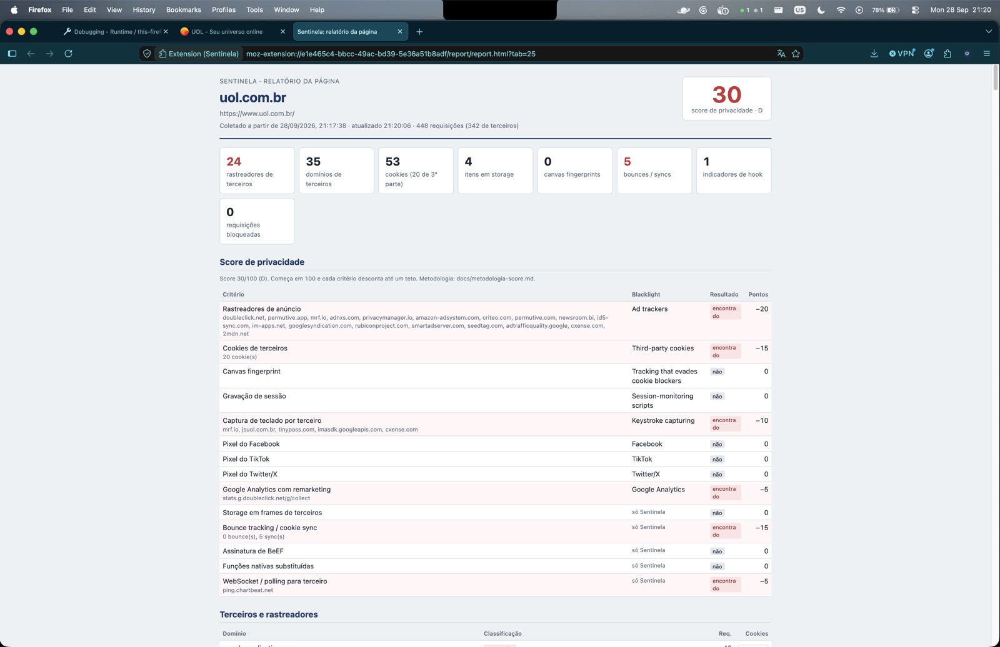

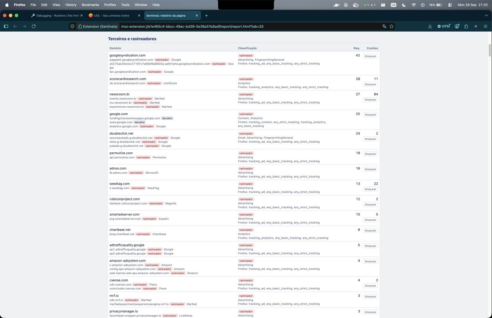

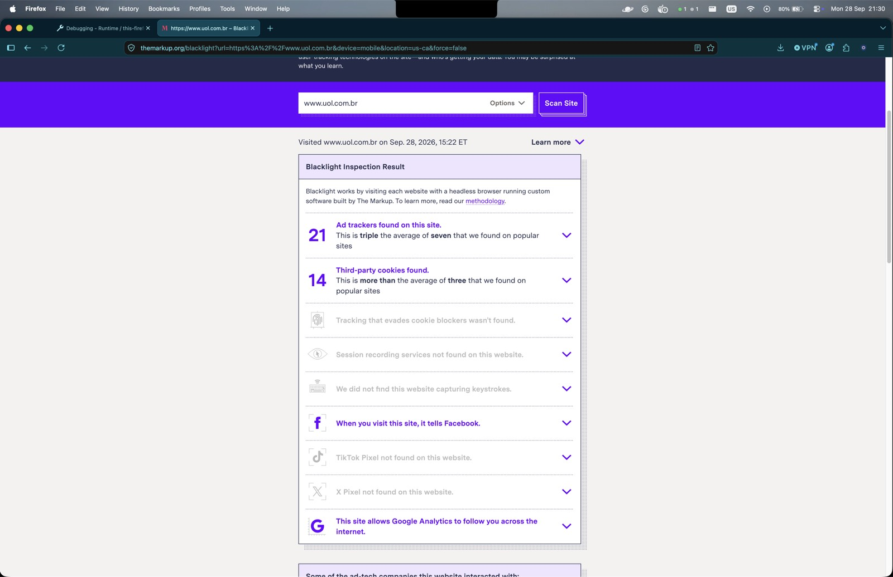

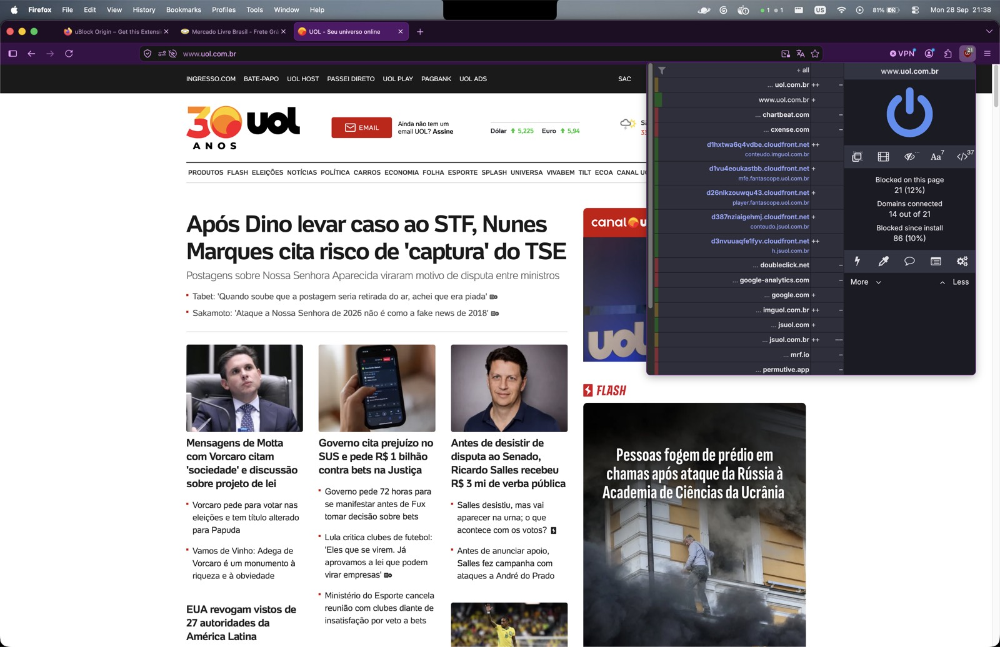

**Achados.**

- **Rastreadores**: 24 sites rastreadores de terceiros, dos quais 18 são de
  anúncio pela Disconnect (googlesyndication, doubleclick, adnxs, rubiconproject, smartadserver, criteo,
  amazon-adsystem, seedtag, permutive, id5-sync, im-apps…). Isso é típico de
  *header bidding*: vários leilões de anúncio na mesma página.
- **Cookies de terceiros**: 20. O `newsroom.bi` (Marfeel) sozinho define 84
  eventos de cookie.
- **55 tentativas de cookie rejeitadas**: scripts gravaram cookies com
  `Domain=.com.br` (37) e `Domain=.br` (18). É *cookie domain probing*: o script
  tenta gravar em cada nível do domínio para descobrir qual é o registrável. O
  navegador rejeita (sufixo público), e a Sentinela registra e deixa fora da
  contagem.
- **5 cookie syncs**: identificadores guardados em cookies de 1ª parte do UOL e
  enviados a terceiros. São o ID do comScore (`cs_fpcu`) para
  scorecardresearch.com, cookies do Google Ads (`cookie`, `gpic`) para
  doubleclick.net, o ID do Chartbeat (`u`) para chartbeat.net, o ID do Cxense
  (`ckp`) para cxense.com e um identificador para criteo.com.
- **Polling**: `ping.chartbeat.net/ping`, 7 chamadas a cada ~17,5 s. É o
  "heartbeat" de analytics do Chartbeat: legítimo, mas é exatamente o padrão que
  o critério mede.

**Reconciliação.**

- **HAR e Sentinela concordam** nos 35 sites de terceiros.
- **uBlock**: bloqueou 7 domínios (chartbeat.com, cxense.com, doubleclick.net,
  google-analytics.com, mrf.io, permutive.app, scorecardresearch.com), todos
  também marcados pela Sentinela.
- **Sentinela marca e o uBlock não mostra bloqueio**: os outros 17 rastreadores,
  googlesyndication, adnxs, rubiconproject e amazon-adsystem entre eles. O
  uBlock bloqueia o script do Google Publisher Tag e do Prebid **antes** de o
  leilão começar, então esses domínios nem chegam a ser contatados no perfil
  "ublock" (bloqueio em cadeia). Por isso o uBlock mostra 14 de 21 domínios
  conectados, contra 35 sites de terceiros sem bloqueio.
- **Domínios do próprio UOL como terceiros** (`jsuol.com.br`, `imguol.com.br`,
  `uol.com`): CDNs da empresa com eTLD+1 diferente. Para o navegador são
  terceiros, e a Sentinela os mostra como "terceiro", não como rastreador.

**Reconciliação com o Blacklight, empresa a empresa.** O Blacklight atribui os
21 ad trackers a 13 empresas e os cookies de terceiros a 3 (print completo em
`uol-blacklight-completo.png`). Cada empresa foi procurada nos domínios do
`uol.har`:

| Empresa (Blacklight) | Requisições no HAR | Sentinela | Explicação |
|---|---|---|---|
| Alphabet (Google) | 91 (doubleclick, googlesyndication, google-analytics…) | rastreador | concordam |
| Comscore | 23 (`scorecardresearch.com`) | rastreador + sync `cs_fpcu` | concordam; a Sentinela ainda vê o ID do cookie de 1ª parte indo para o comScore |
| Magnite | 10 (`fastlane.rubiconproject.com`) | rastreador | concordam |
| Smartadserver | 8 (`prg.smartadserver.com`) | rastreador | concordam |
| Chartbeat | 8 (`chartbeat.com`/`.net`) | rastreador + polling | concordam |
| Amazon | 4 (`amazon-adsystem.com`) | rastreador | concordam |
| ID5 | 2 (`id5-sync.com`) | rastreador | concordam |
| Criteo | 2 (`gum.criteo.com`) | rastreador + sync | concordam |
| Verizon Media, RTB House, PubMatic, DoubleVerify, Lotame | **0** | não viu | nenhuma requisição a `yahoo`, `aol`, `creativecdn`, `pubmatic`, `doubleverify` ou `crwdcntrl` no HAR. São participantes do leilão (header bidding) que entram ou não conforme o lance de cada visita e a região: o Blacklight visitou dos EUA às 15:22 ET, a coleta foi no Brasil às 21:17 |
| Facebook | **0** | não viu | nenhuma requisição a `facebook`/`fbcdn` no HAR; o pixel é carregado pelo gerenciador de tags para outro público (Blacklight: celular, Califórnia) |
| Microsoft | **0** | não viu | nenhuma requisição a `bing`, `clarity` ou `microsoft` no HAR; mesmo motivo, e os cookies que o Blacklight atribui à Microsoft vêm desse script |
| Universo Online (cookies) | — | 1ª parte / CDN do UOL | o Blacklight conta como terceiro o cookie de `uol.com` (outro eTLD+1), como a Sentinela |

Das 13 empresas de anúncio, **8 aparecem no HAR e a Sentinela classifica todas
como rastreador**; as 5 restantes, mais Facebook e Microsoft, não têm nenhuma
requisição na visita coletada, então a divergência é de **visita diferente**,
não de detecção.

### 4.3 mercadolivre.com.br

Coleta em 28/09/2026: HAR de 21:24:19 a 21:24:50 (437 entradas, duas cargas da
página). URL final `https://www.mercadolivre.com.br/`, sem redirecionamento.
Banner de cookies: "Usamos cookies para melhorar sua experiência…" com "Aceitar
cookies" e "Configurar cookies", não clicado. Blacklight: 28/09, 18:33 ET, com
URL final `?skipInApp=true&matt_…`.

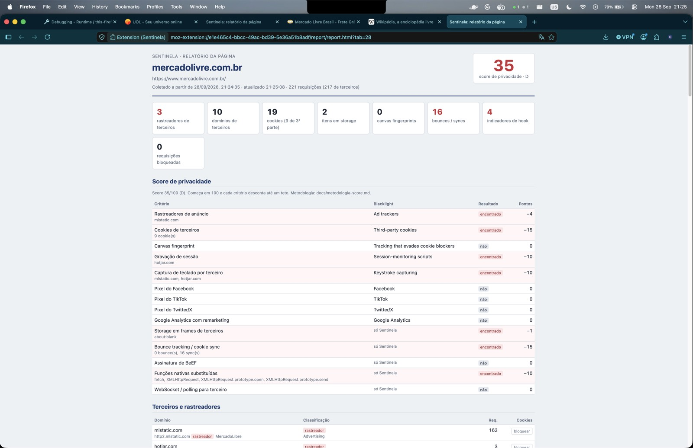

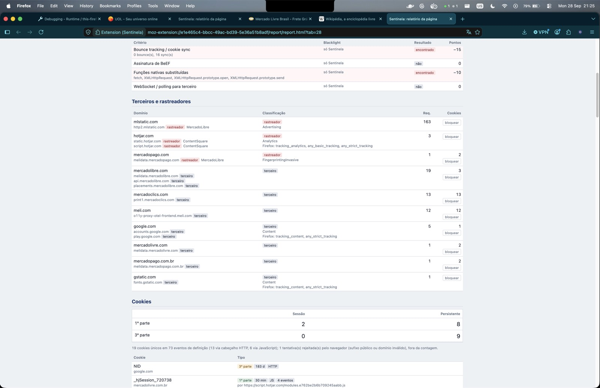

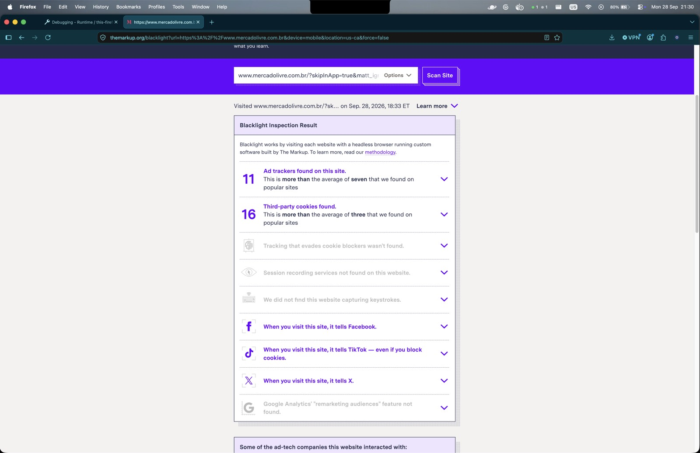

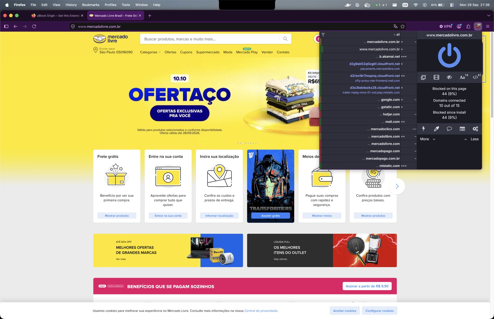

**Achados.**

- **Gravação de sessão: Hotjar** (`static.hotjar.com/c/hotjar-720738.js` e
  módulos em `script.hotjar.com`, 5 requisições no HAR). O script grava o cookie
  `_hjSession_720738` (30 min) e registra listeners de teclado.
- **Funções nativas substituídas**: `fetch`, `XMLHttpRequest`,
  `XMLHttpRequest.prototype.open` e `.send`. O perfil é de instrumentação de
  observabilidade (o HAR mostra `o11y-proxy-otel-frontend.meli.com`, OpenTelemetry)
  e de SDKs de analytics, que envolvem as APIs de rede. É o mesmo mecanismo que um
  hook malicioso usaria. A Sentinela aponta o fato, mas não consegue atribuir o
  script.
- **16 syncs, mas de um único identificador**: o mesmo valor (parâmetro `value`)
  guardado em cookie e enviado entre `mercadolivre.com.br`, `mercadolivre.com`,
  `mercadolibre.com`, `mercadopago.com` e `mercadopago.com.br`, todos da mesma
  empresa. Para o navegador são sites diferentes, então é sync por definição;
  para o usuário é uma empresa só. Essa limitação da definição por eTLD+1 volta
  na seção 5.3.

**Reconciliação.**

- **HAR e Sentinela concordam** nos 10 sites de terceiros.
- **Sentinela classifica `mlstatic.com` como rastreador e o uBlock o libera**:
  `mlstatic.com` é o CDN de imagens e scripts do Mercado Livre (163 das 219
  requisições). A Disconnect o classifica como Advertising (MercadoLibre); o
  uBlock o libera porque bloquear o CDN quebraria o site. É uma divergência de
  **lista**, não de tráfego.
- **uBlock bloqueia e a Sentinela não marca rastreador**: `mercadoclics.com`
  (13 requisições, 13 cookies; o nome já indica medição de cliques),
  `mercadolibre.com`, `mercadolivre.com`, `mercadopago.com.br` (os `melidata.*`,
  telemetria do próprio Mercado Livre) e parte de `google.com`. Esses domínios
  estão nas listas do uBlock (EasyPrivacy e filtros próprios), mas não na
  Disconnect nem na classificação do Firefox.
- **Blacklight viu Facebook, TikTok e X; a Sentinela não**: o HAR não tem
  **nenhuma** requisição a `facebook`, `tiktok`, `twitter` ou `t.co`. O Blacklight
  visitou a URL com `device=mobile` e `location=us-ca` (a URL final dele tem
  `?skipInApp=true&matt_…`, parâmetros de campanha), e os pixels de rede social
  são carregados para visitantes móveis dos EUA. No acesso desktop do Brasil,
  eles não carregaram.

**Reconciliação com o Blacklight, empresa a empresa** (print completo em
`mercadolivre-blacklight-completo.png`):

| Empresa (Blacklight) | Requisições no HAR | Explicação |
|---|---|---|
| Alphabet (ad tracker) | 11 (`accounts.google.com` ×8, `play.google.com` ×3) | concordam no domínio, mas no HAR são o login do Google (One Tap) e a Play Store, não anúncios; a Sentinela os mostra como terceiro e o uBlock bloqueia parte de `google.com` |
| Twitter/X (ad tracker, pixel e cookie) | **0** | nenhuma requisição a `twitter`, `ads-twitter` ou `t.co` no HAR |
| Facebook (ad tracker e pixel) | **0** | nenhuma requisição a `facebook`/`fbcdn` no HAR |
| RTB House (ad tracker e cookie) | **0** | nenhuma requisição a `creativecdn`/`rtbhouse` no HAR |
| ByteDance/TikTok (pixel com *advanced matching* e cookie) | **0** | nenhuma requisição a `tiktok` no HAR |
| Microsoft (cookie) | **0** | nenhuma requisição a `bing`, `clarity` ou `microsoft` no HAR |

Todas as empresas de anúncio que o Blacklight cita, exceto o Google, têm
**zero** requisições no HAR da visita brasileira em desktop. A lista "Some of the
ad-tech companies" do Blacklight para o Mercado Livre tem só Alphabet, o que
mostra que os pixels de rede social foram carregados pelos scripts do próprio
Mercado Livre (a URL dele termina em `?skipInApp=true&matt_…`, parâmetros de
campanha), sem passar por uma rede de anúncios. Por isso a Sentinela vê só 1
rastreador de anúncio pela Disconnect (`mlstatic.com`) e o Blacklight vê 11.

### 4.4 pt.wikipedia.org

Coleta em 28/09/2026: HAR de 21:23:57 a 21:25:27 (39 entradas).
`https://pt.wikipedia.org/` redireciona (301) para
`/wiki/Wikipédia:Página_principal`. Sem banner de cookies. Blacklight: 28/09,
16:53 ET.

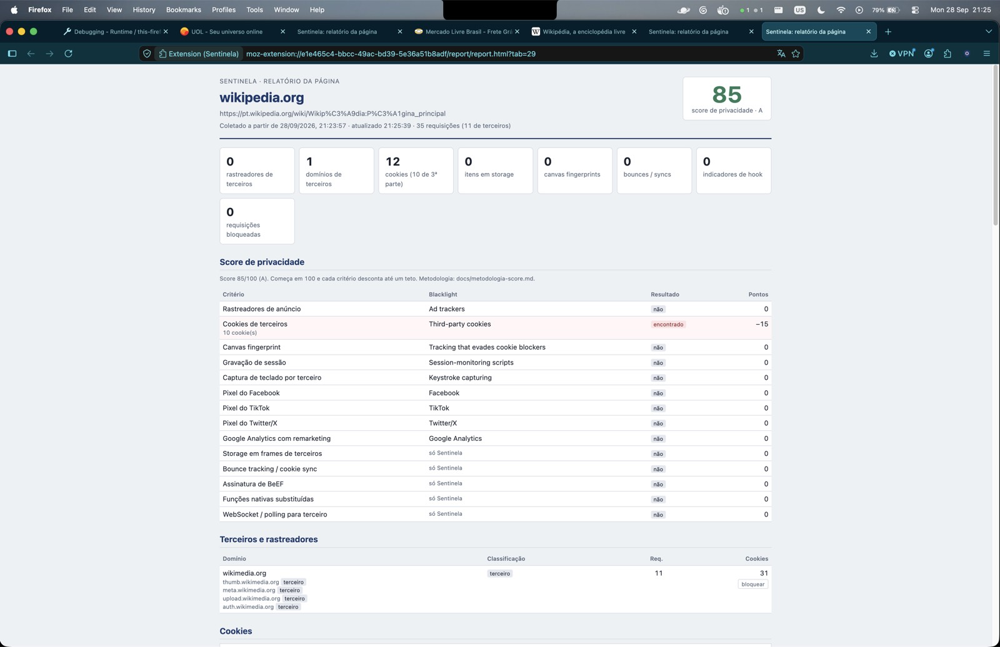

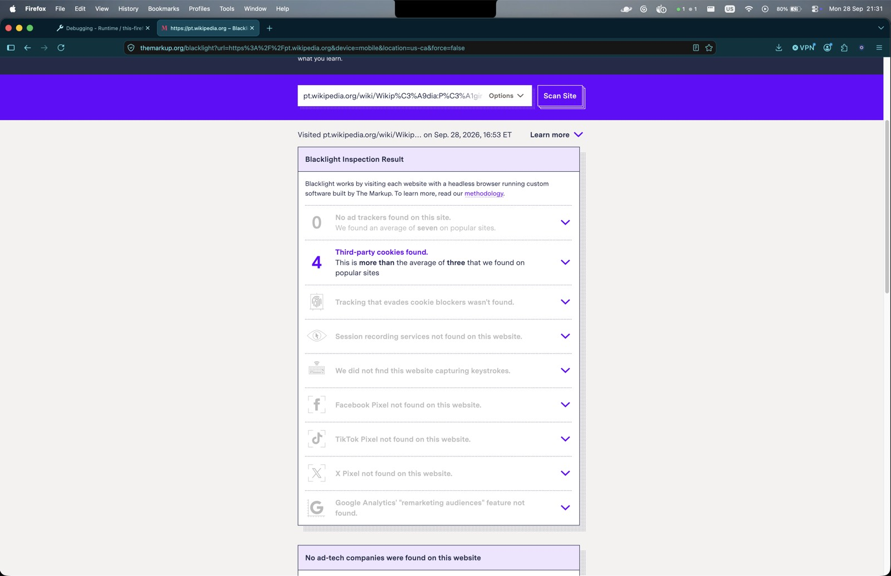

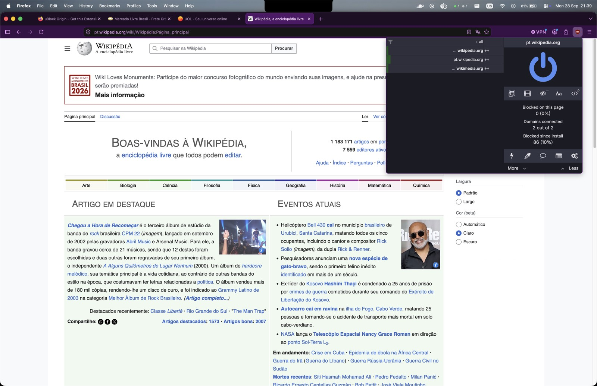

A Wikipedia serve de controle: **nenhum rastreador**, nenhum anúncio,
fingerprint ou sync. As três ferramentas concordam, e o uBlock bloqueou
0 requisições. O único indicador da aba Ameaças são 2 scripts de
`meta.wikimedia.org` injetados pelo carregador da própria Wikipedia
(`load.php`): o mapa WikiMiniAtlas e o banner do concurso Wiki Loves
Monuments (`Special:BannerLoader?campaign=wlm_2026_br`). Eles contam como
"terceiro" só porque `wikimedia.org` é outro eTLD+1, e não entram no score.

O único terceiro é `wikimedia.org` (11 requisições: `upload.`, `thumb.`,
`meta.` e `auth.wikimedia.org`), que define 10 cookies de 3ª parte. São os
cookies do **login central** da Wikimedia (CentralAuth), usados para manter a
sessão entre Wikipedia, Commons e outros projetos, e não para publicidade. O
Blacklight contou 4, provavelmente só os que ficaram gravados no fim da visita
dele (o Chromium dele usa outras regras de cookie de terceiros). A Sentinela
conta toda definição que viu. Esses 10 cookies custam 15 pontos no score (teto
do critério), e isso mostra uma limitação do critério: ele não distingue
cookie de login de cookie de rastreamento.

No print completo do Blacklight (`wikipedia-blacklight-completo.png`), os 4
cookies de terceiros são todos da **Wikimedia Foundation**, e a seção de ad-tech
diz "No ad-tech companies were found on this website". Ou seja, as três
ferramentas concordam no único terceiro (`wikimedia.org`), e a diferença 10 × 4
é só de contagem.

### 4.5 Causas típicas de divergência

| Causa | Exemplo nesta coleta | Efeito |
|---|---|---|
| Ambiente do Blacklight (Chromium sem proteção, celular, Califórnia) | pixels de Facebook, TikTok e X no Mercado Livre sem nenhuma requisição no HAR | o Blacklight vê pixels e anúncios servidos para outra região e dispositivo |
| Janela normal × privada no Firefox | só 2 requisições com status 0 nos três HARs | a Sentinela vê os rastreadores rodando, não só tentando |
| Bloqueio em cadeia do uBlock | UOL: 14 de 21 domínios conectados com uBlock, contra 35 sites de terceiros sem ele | o uBlock bloqueia o script que chamaria os outros, e eles nem aparecem |
| Listas diferentes (Disconnect × EasyList/EasyPrivacy × Tracker Radar) | `mlstatic.com` rastreador para a Disconnect e liberado pelo uBlock; `mercadoclics.com` o contrário | mesma requisição, classificação diferente |
| Terceiro por eTLD+1 × por empresa | `jsuol.com.br`, `mlstatic.com`, `mercadopago.com` | CDNs e domínios da própria empresa contam como terceiros e geram syncs internos |
| Método de medição | captura de teclado: listener (Sentinela) × texto enviado (Blacklight) | a Sentinela aponta mais sites que o Blacklight |
| Momento da captura | UOL 426 × 401; Mercado Livre 219 × 437 | HAR e JSON cobrem intervalos diferentes |
| Cookies definidos × cookies presentes | Wikipedia 10 × 4 | a Sentinela conta cada definição, o Blacklight conta o que ficou no fim |
| Carregamento por amostragem | Hotjar no Mercado Livre visto só pela Sentinela | uma visita pode carregar o script e outra não |

## 5. Entregável 4: score de privacidade {: .newpage }

### 5.1 Metodologia

O score vai de 0 a 100 (maior = mais privado). Toda página começa com 100 e
perde pontos por critério, com **teto por critério** para que uma categoria
sozinha não zere a nota. Os critérios 1 a 9 são as nove verificações atuais do
Blacklight, com o mesmo nome, para a comparação ser direta. Os critérios 10 a
14 medem o que o Blacklight não mede.

| # | Critério | Blacklight | Desconto |
|---|---|---|---|
| 1 | Rastreadores de anúncio | Ad trackers | −4 por domínio, até −20 |
| 2 | Cookies de terceiros | Third-party cookies | −2 por cookie, até −15 |
| 3 | Canvas fingerprint | Tracking that evades cookie blockers | −15 |
| 4 | Gravação de sessão | Session-monitoring scripts | −10 |
| 5 | Captura de teclado por terceiro | Keystroke capturing | −10 |
| 6 | Pixel do Facebook | Facebook | −5 |
| 7 | Pixel do TikTok | TikTok | −5 |
| 8 | Pixel do Twitter/X | Twitter/X | −5 |
| 9 | Google Analytics com remarketing | Google Analytics | −5 |
| 10 | Storage em frames de terceiros | — | −1 por frame, até −5 |
| 11 | Bounce tracking / cookie sync | — | −10 por ocorrência, até −15 |
| 12 | Assinatura de BeEF | — | −40 |
| 13 | Funções nativas substituídas | — | −10 |
| 14 | WebSocket / polling para terceiro | — | −5 cada, até −10 |

Faixas: A ≥ 85, B ≥ 70, C ≥ 50, D ≥ 30, F < 30.

**Justificativa dos pesos.** Os pesos seguem dois princípios: **quanto o usuário
consegue se defender** e **quanto a prática liga a pessoa entre sites**.

- **Hijacking pesa mais que tudo.** Não é rastreamento, é comprometimento: quem
  controla o hook executa comandos no navegador. Uma assinatura de BeEF sozinha
  leva a nota a D.
- **Fingerprint (−15) pesa mais que cookies.** Apagar cookies e usar aba anônima
  não o impedem.
- **Bounce e sync (−10 cada)** contornam o bloqueio de cookies de terceiros.
- **Gravação de sessão e captura de teclado (−10)** expõem o conteúdo do que a
  pessoa faz e digita.
- **Anúncios (−4) e cookies de terceiros (−2)** são as práticas mais comuns.
  Descontam por item, porque cada empresa a mais é mais um perfil sobre o
  usuário, mas com teto.
- **Pixels (−5)** ligam a visita à conta da pessoa na rede social.

A versão completa está em `docs/metodologia-score.md`, e a implementação em
`extension/background/score.js`.

### 5.2 Resultados

| Critério (Blacklight) | UOL: Sentinela | UOL: Blacklight | ML: Sentinela | ML: Blacklight | Wiki: Sentinela | Wiki: Blacklight |
|---|---|---|---|---|---|---|
| Ad trackers | 18 dom. (−20) | 21 (−20) | 1 dom.: mlstatic (−4) | 11 (−20) | 0 | 0 |
| Third-party cookies | 20 (−15) | 14 (−15) | 9 (−15) | 16 (−15) | 10 (−15) | 4 (−8) |
| Evades cookie blockers | não | não | não | não | não | não |
| Session monitoring | não | não | **Hotjar (−10)** | não | não | não |
| Keystroke capturing | **sim (−10)** | não | **sim (−10)** | não | não | não |
| Facebook | não | **sim (−5)** | não | **sim (−5)** | não | não |
| TikTok | não | não | não | **sim (−5)** | não | não |
| Twitter/X | não | não | não | **sim (−5)** | não | não |
| Google Analytics remarketing | sim (−5) | sim (−5) | não | não | não | não |
| **Score nos 9 critérios** | **50** | **55** | **61** | **50** | **85** | **92** |
| Critérios só da Sentinela | sync −15, polling −5 | — | sync −15, nativas −10, storage −1 | — | — | — |
| **Score final da Sentinela** | **30 (D)** | | **35 (D)** | | **85 (A)** | |

A coluna "Blacklight" aplica a mesma tabela de pesos às contagens que o
Blacklight reportou (transcritas em `<site>-blacklight.txt`).

### 5.3 Comparação crítica com o Blacklight

**Onde concordam.**

- A **ordem** dos sites é a mesma nas duas ferramentas: a Wikipedia é muito mais
  privada que UOL e Mercado Livre.
- No UOL, as duas acham volume parecido de rastreadores de anúncio (18 × 21) e
  cookies de terceiros (20 × 14), acham o Google Analytics com remarketing
  (`stats.g.doubleclick.net`) e não acham fingerprint nem gravação de sessão.
- Na Wikipedia, as duas não acham nada além de cookies de terceiros.

**Onde divergem e por quê.**

1. **Ambiente (causa principal).** O Blacklight visitou os sites com Chromium
   automatizado em modo **mobile, a partir da Califórnia**, sem proteções. A
   Sentinela mediu o Firefox desktop no Brasil com ETP Padrão. Isso explica os
   pixels de Facebook, TikTok e X no Mercado Livre e o Facebook no UOL: o HAR dos
   dois sites **não tem nenhuma requisição** a esses domínios. Anúncios e pixels
   são servidos conforme região, dispositivo e campanha.
2. **Captura de teclado: métodos diferentes.** O Blacklight digita nos campos e
   verifica se o texto sai na rede antes do envio (vazamento real). A Sentinela
   detecta **listener de teclado registrado por script de terceiro** (capacidade).
   A Sentinela é mais ampla e gera falsos positivos:
   - No Mercado Livre, os listeners vêm do Hotjar (captura real de interação,
     que merece o alerta) e também de `mlstatic.com/.../searchbox.js`, a caixa de
     busca do próprio site servida pelo CDN.
   - No UOL, vêm de scripts como `mrf.io` (Marfeel) e `tinypass.com` (Piano),
     mas também de `jsuol.com.br`, o CDN do próprio UOL.

   O Blacklight não reportou captura em nenhum dos dois. A leitura correta é que
   a Sentinela mostra **quem poderia** capturar teclas, e o Blacklight mostra
   **quem enviou** o texto digitado.
3. **Gravação de sessão.** A Sentinela viu o Hotjar carregar no Mercado Livre
   (5 requisições no HAR), e o Blacklight não. O Hotjar costuma ser carregado
   por amostragem (só para uma fração das visitas) e conforme o dispositivo. A
   visita mobile do Blacklight pode não ter sido sorteada.
4. **"Terceiro" técnico × terceiro de verdade.** A Sentinela segue a definição
   do navegador (eTLD+1), e isso faz CDNs da própria empresa (`mlstatic.com`,
   `jsuol.com.br`) e domínios irmãos (`mercadopago.com` ×
   `mercadolivre.com.br`) contarem como terceiros. Resultados: `mlstatic.com`
   entra como "rastreador de anúncio" pela Disconnect, os 16 syncs do Mercado
   Livre são do mesmo ID dentro da mesma empresa, e parte dos listeners de
   teclado é do próprio site. O Blacklight usa a Tracker Radar do DuckDuckGo, que
   agrupa domínios por **entidade** (empresa) e evita esses casos. Um passo
   natural para a Sentinela seria usar esse mapeamento de entidades.
5. **O que só a Sentinela mede pesa muito.** No Mercado Livre, o score cai de 61
   para 35 com sync (−15), nativas substituídas (−10) e storage (−1). No UOL cai
   de 50 para 30 com os 5 syncs reais (comScore, Google, Chartbeat, Cxense,
   Criteo) e o polling do Chartbeat. Os syncs do UOL são exatamente o tipo de
   rastreamento que o Blacklight não vê, porque ele não compara valores de
   cookies com parâmetros de URL.
6. **Cookies**: a Sentinela conta cookies **definidos** (tentativas; com o TCP
   eles ficam particionados), e o Blacklight conta os presentes no fim da visita.
   Na Wikipedia (10 × 4), a diferença é o login central da Wikimedia, que a
   Sentinela vê definir e redefinir cookies.

**Conclusão.** Nos critérios que as duas medem, a Sentinela e o Blacklight
chegam a notas próximas (diferença de 5 a 11 pontos) e à mesma ordem. As
divergências vêm de três fontes identificáveis: o ambiente de coleta (região e
dispositivo), o método (capacidade × vazamento na captura de teclado) e a
definição de terceiro (eTLD+1 × entidade). A Sentinela acrescenta sinais que o
Blacklight não tem (sync, bounce, hooks, storage), e eles mudam bastante a nota
do UOL e do Mercado Livre.

## 6. Limitações {: .newpage }

- **Terceiro por eTLD+1**: CDNs e domínios da mesma empresa contam como
  terceiros (seção 5.3). Um mapeamento de entidades resolveria.
- **Captura de teclado** mede listeners, não vazamento.
- **Service workers**: requisições com `tabId = -1` não entram no relatório da
  aba, mas são bloqueadas quando a lista manda.
- **Cookies**: um `Set-Cookie` observado não garante cookie gravado; o TCP
  particiona cookies de terceiros.
- **Hooks**: o detector compara identidade de funções e globais, mas não
  atribui **qual** script substituiu uma nativa.
- **Discrição**: uma página hostil ainda pode detectar a instrumentação por
  outros meios (descritores nos protótipos, tempo de execução).
- **Classificação de rastreador**: depende da lista Disconnect; domínios que só
  estão nas listas do uBlock aparecem como "terceiro".

## 7. Conclusão

A Sentinela cobre o que a avaliação pede: detecta conexões a terceiros e
rastreadores, classifica cookies (1ª/3ª parte, sessão/persistente, HTTP/JS),
mede o armazenamento HTML5 por frame, identifica canvas fingerprint, bounce
tracking, cookie sync, parâmetros de rastreamento e indicadores de hook,
calcula um score com metodologia explícita e bloqueia domínios de uma lista
pessoal.

Nas páginas do DuckDuckGo, as detecções bateram com o esperado. As divergências
vêm de a extensão observar sem proteger (não embaralha o canvas, não remove
parâmetros, não particiona storage, papel que é do Firefox) e de diferenças de
definição, como bounce por site e não por origem. Três problemas encontrados
durante os testes foram corrigidos: a extensão aparecia na js-leaks, o
`serviceworker-fetch` escapava do bloqueio e cookies de sufixo público inflavam
as contagens.

Nos sites reais, a Sentinela e o Blacklight chegaram à mesma ordem (Wikipedia
muito melhor que UOL e Mercado Livre) e a notas próximas nos critérios que os
dois medem. As diferenças têm causa identificável no tráfego: o ambiente de
coleta, o método de cada ferramenta e a definição de terceiro. O que só a
Sentinela vê, principalmente os cookie syncs do UOL para comScore, Google,
Chartbeat, Cxense e Criteo, é o que mais pesa na nota final e o que um usuário
comum não teria como perceber.

## 8. Uso de IA

Declaro que usei IA como ferramenta de apoio neste trabalho: o Claude
(Anthropic), no Claude Code, como assistente de programação. Eu defini o que
seria feito e como: as decisões de desenvolvimento, a ordem das fases, os sites
analisados, os critérios do score (alinhados ao Blacklight) e a validação de
cada etapa. A IA escreveu a maior parte do código da extensão, dos scripts de
apoio e do texto deste relatório, seguindo essas decisões. Testei todas as
funcionalidades no Firefox, e várias correções vieram desses testes
(classificação por host, cookies de sufixo público, falso positivo de sync,
bloqueio de service worker). Coletei todas as evidências (prints, HARs, JSONs,
Blacklight e uBlock) no meu navegador, e os números do relatório saem delas.

## Anexo: evidências

Tudo está em `evidencias/` no repositório:

- `ddg/`: prints e JSONs das páginas do DDG, numerados como na tabela 3.1.
- `hook/`: página própria de hook e js-leaks.
- `sites/<site>/`: HAR, JSON da Sentinela, prints do relatório, Blacklight e
  uBlock (com transcrição em `.txt`) e reconciliação domínio a domínio
  (`<site>-reconciliacao.md`).
- `ROTEIRO.md`: roteiro de coleta.

As imagens deste PDF são cópias comprimidas dos prints originais.
